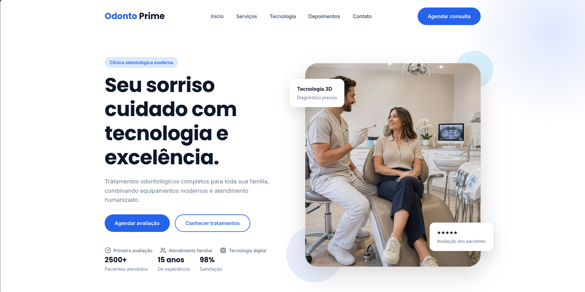
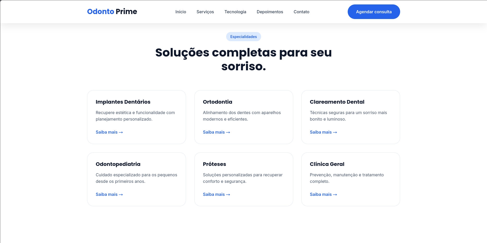
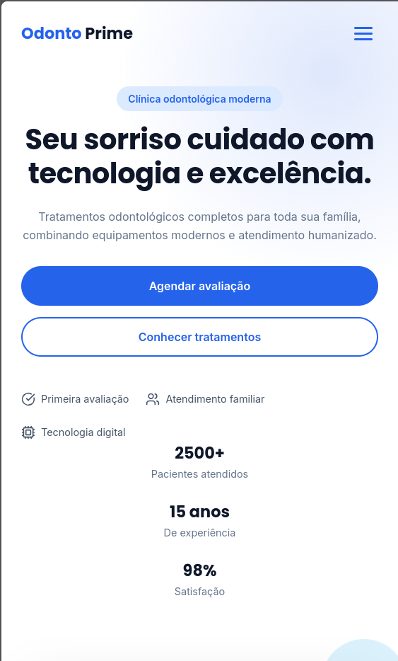

# 🦷 OdontoPrime




Landing page profissional desenvolvida para uma clínica odontológica moderna.

O projeto simula uma página real de conversão, com foco em **agendamento de consultas**, **confiança do paciente** e **apresentação de serviços odontológicos**.

---

## 🌐 Demonstração

🔗 Acesse a versão online:

https://odontoprime.vercel.app


*(link demonstrativo — substituir pelo endereço real após publicação)*


---

# 📸 Screenshots


## Página inicial


## Serviços




## Versão mobile




---

# 🎯 Objetivo do projeto

Criar uma landing page capaz de transformar visitantes em pacientes através de:

- comunicação clara;
- prova social;
- chamadas para ação;
- design moderno;
- experiência responsiva.

---

# ✨ Funcionalidades

## Navegação

✅ Menu responsivo  
✅ Scroll suave  
✅ Header dinâmico  
✅ Navegação por seções  


## Conversão

✅ Formulário de agendamento  
✅ Integração com WhatsApp  
✅ Botões de chamada para ação  
✅ Seção de depoimentos  


## Experiência visual

✅ Animações ao rolar a página  
✅ Contadores animados  
✅ FAQ interativo  
✅ Layout adaptado para dispositivos móveis  


---

# 🚀 Tecnologias utilizadas


## Front-end

- HTML5
- CSS3
- JavaScript Vanilla


## Recursos

- CSS Grid
- Flexbox
- CSS Variables
- Intersection Observer API
- Responsive Design
- Lucide Icons


---

# 📂 Estrutura do projeto


```
odontoprime/

│
├── index.html
│
├── README.md
│
└── assets/
    │
    ├── css/
    │   ├── style.css
    │   ├── responsive.css
    │   └── animations.css
    │
    ├── js/
    │   ├── main.js
    │   ├── counter.js
    │   ├── faq.js
    │   ├── slider.js
    │   ├── reveal.js
    │   └── contact.js
    │
    ├── images/
    │   ├── hero.webp
    │   └── technology.webp
    │
    ├── screenshots/
    │   ├── hero.png
    │   ├── services.png
    │   └── mobile.png
    │
    └── favicon.svg

```

---

# 📱 Responsividade

O projeto foi desenvolvido pensando em diferentes dispositivos:

- Desktop
- Tablets
- Smartphones


---

# 🔮 Melhorias futuras

Possíveis evoluções:

- Área administrativa para gerenciamento de consultas;
- Integração com banco de dados;
- Sistema de calendário;
- Google Analytics;
- SEO avançado;
- CMS para edição de conteúdo.


---

# 👨‍💻 Autor

Projeto desenvolvido para fins de estudo e demonstração de habilidades em desenvolvimento web.
